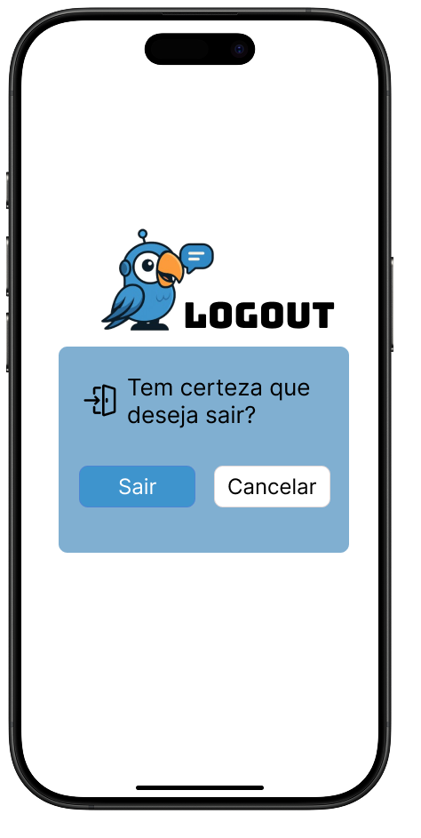
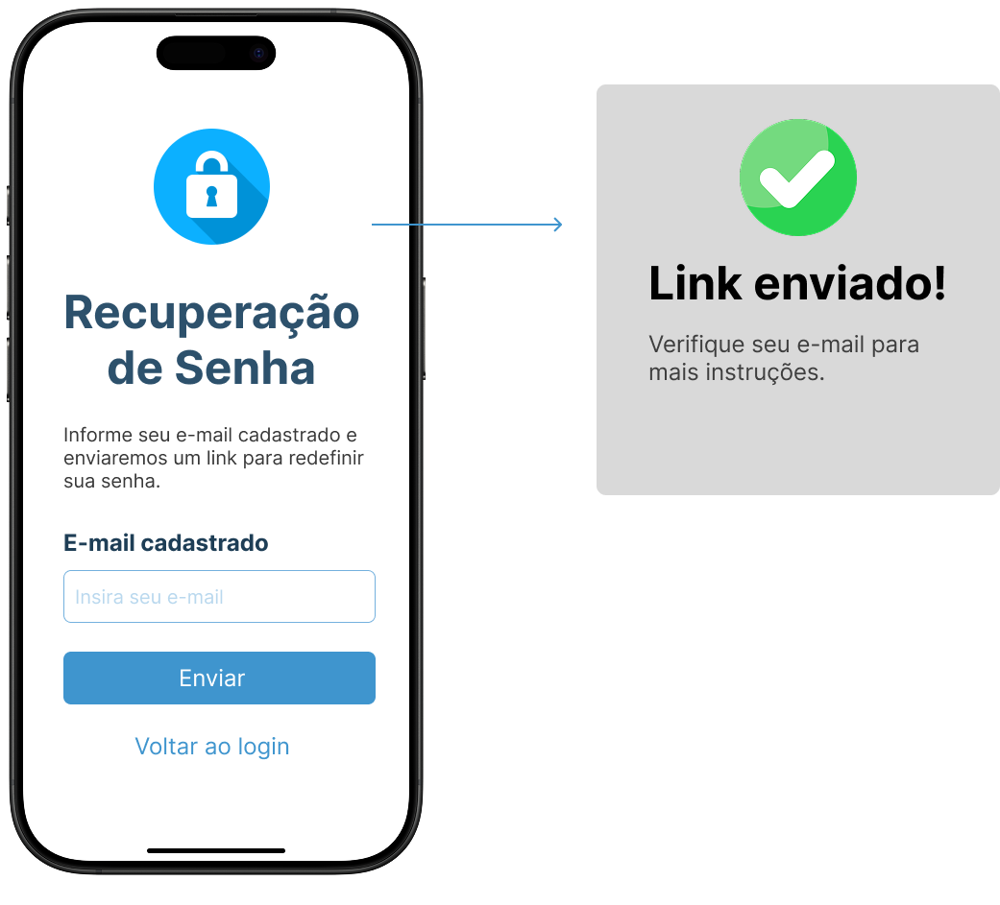
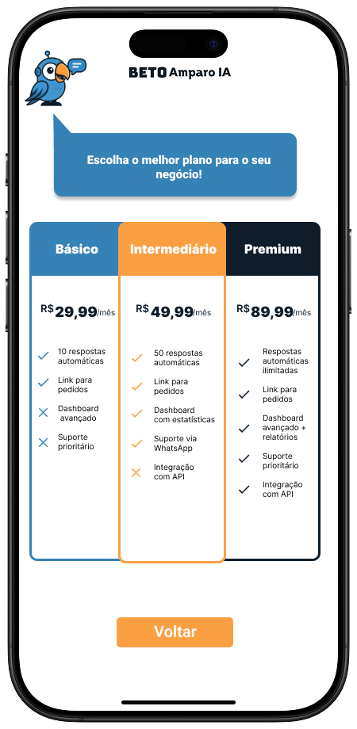
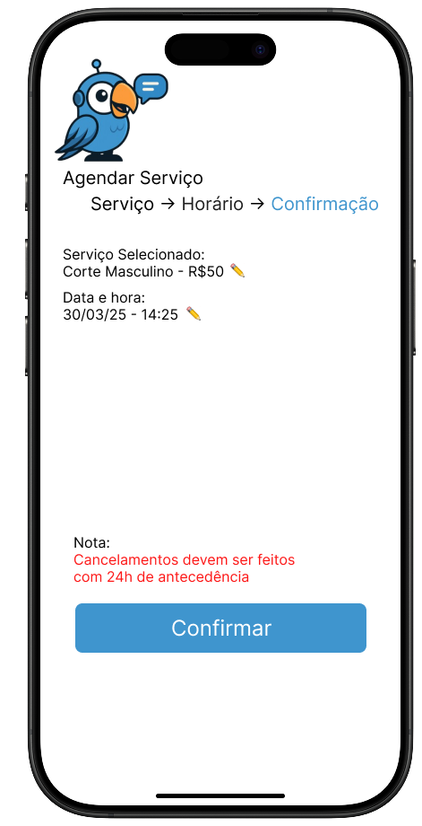
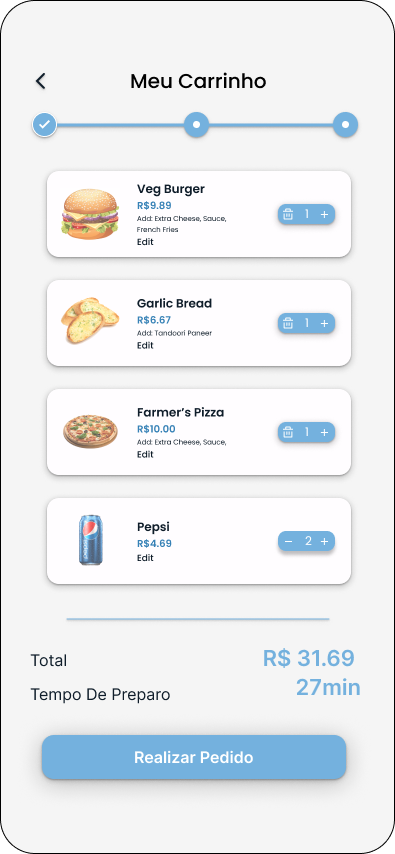
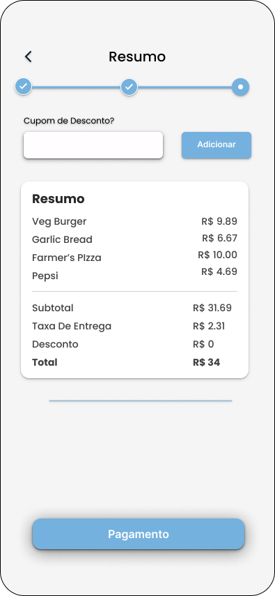
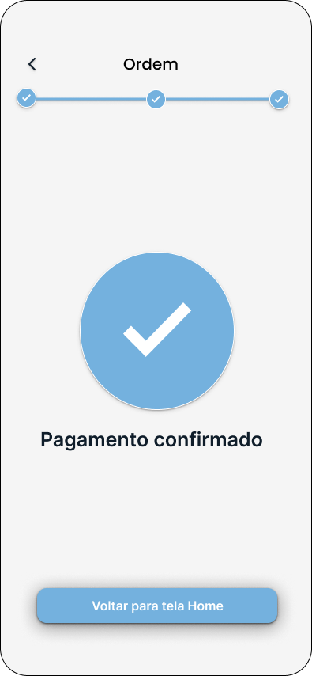
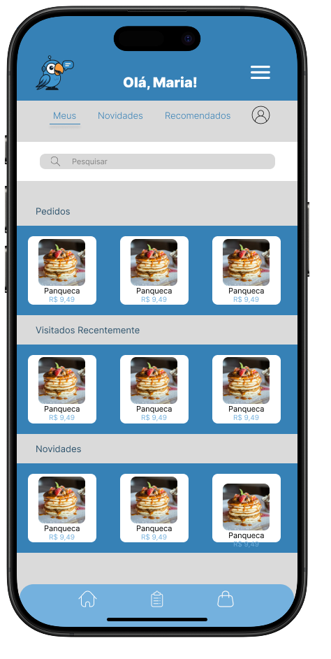

# #️⃣ Beto Amparo
## Universidade
Universidade Federal do Tocantins
## Curso
Ciência da Computação
## Disciplina
Projeto de Sistemas
## Semestre
1º semestre de 2025
## Professor
Edeílson Milhomem
<h2>Integrantes do Projeto</h2>
  <table>
    <tr>
      <td>Gabriel Martiliano</td>
    </tr>
    <tr>
      <td>Ester Arraiz de Matos</td>
    </tr>
    <tr>
      <td>Neci Oneides da Silva</td>
    </tr>
    <tr>
      <td>Heloisa Rolins Ribeiro</td>
    </tr>
    <tr>
      <td>Dallyla de Moraes Sousa</td>
    </tr>
  </table>

## 📊 Validação da Ideia

Para validar a necessidade do sistema Beto Amparo, realizamos uma pesquisa via Forms com pequenos empreendedores que utilizam o WhatsApp como canal de atendimento e vendas. Os principais resultados foram:

- 🔁 **64,3%** dos entrevistados já **perderam vendas** por conta da demora no atendimento.
- 🕒 **50%** levam de **5 a 30 minutos** para responder mensagens de clientes.
- ⚡ Apenas **35,7%** respondem **em menos de 5 minutos**.

Esses dados mostram uma demanda real por soluções que automatizem o primeiro contato com o cliente e agilizem pedidos e agendamentos, reforçando a relevância da proposta.

## 🧩 Canvas do Projeto Beto Amparo

| **Seção**                 | **Descrição** |
|---------------------------|--------------|
| **Proposta de Valor**     | Criar um sistema híbrido de atendimento humanizado que combina WhatsApp Business (para interação inicial) e uma plataforma web (para funcionalidades avançadas), permitindo atendimento, pedidos e agendamentos de forma prática e eficiente. |
| **Segmento de Clientes**  | Pequenos negócios e empreendedores que utilizam WhatsApp para vendas e atendimento. Clientes que desejam realizar pedidos e agendamentos sem necessidade de interação humana inicial. |
| **Canais**                | WhatsApp Business (mensagens automáticas com links para o site). Plataforma web responsiva (Next.js + Supabase). Progressive Web App (PWA) para acesso facilitado pelo celular. |
| **Relacionamento com Clientes** | Autoatendimento via WhatsApp e site. Dashboard para acompanhamento de pedidos. Notificações automáticas para manter o cliente informado. |
| **Atividades-Chave**      | Desenvolvimento da plataforma web (Next.js + Supabase). Integração com WhatsApp Business. Implementação do sistema de pedidos e agendamentos. Criação de um dashboard para gerenciamento dos pedidos. Implementação de PWA para donos de negócio. |
| **Recursos Principais**   | Plataforma web com sistema de pedidos e agendamentos. Banco de dados no Supabase para armazenar pedidos e clientes. WhatsApp Business API para envio de mensagens automáticas. Infraestrutura de hospedagem na Vercel. |
| **Parcerias Principais**  | Instituições como SEBRAE para captação de clientes. Donos de pequenos negócios que desejam digitalizar seus atendimentos. |
| **Estrutura de Custos**   | Hospedagem na Vercel (plano gratuito ou pago dependendo da demanda). Uso do Supabase (plano gratuito inicialmente, podendo escalar conforme necessário). Eventual aquisição de domínio personalizado. Investimento em marketing para atrair usuários. |
| **Fontes de Receita**     | Modelo de assinatura paga com três planos: **Básico** (plano mais acessível, funcionalidades essenciais). **Intermediário** (mais funcionalidades que o básico, como personalização básica e relatórios simples). **Avançado** (acesso completo, incluindo automação avançada e relatórios detalhados). Taxa sobre pedidos gerados pela plataforma. Publicidade ou parcerias estratégicas. |

## 💰 Precificação

A monetização da plataforma será feita por meio de um **modelo de assinatura mensal**, dividido em três planos com diferentes funcionalidades.

Todos os planos contam com **7 dias gratuitos** para experimentação, sem compromisso.

### Planos e Valores

| Plano            | Recursos Inclusos                                                                 | Preço Estimado (R$) |
|------------------|------------------------------------------------------------------------------------|----------------------|
| **Básico**       | Página de pedidos e agendamentos, dashboard simples, mensagens automáticas         | R$ 29,90 / mês       |
| **Intermediário**| Tudo do Básico + personalização visual + relatórios simples                        | R$ 49,90 / mês       |
| **Avançado**     | Tudo do Intermediário + relatórios avançados, filtros, integrações adicionais      | R$ 69,90 / mês       |

> 📌 **Observações:**
> - Todos os planos incluem **7 dias grátis** para teste.
> - Os preços são estimativas iniciais e poderão ser ajustados com base no feedback dos usuários após os testes com o MVP.
  
## 🛠️ Escopo do Projeto Beto Amparo</h1>
### Objetivo: Criar um sistema híbrido de atendimento humanizado que combina WhatsApp Business (para interação inicial) + plataforma web (para funcionalidades avançadas), atendimento, pedidos e agendamentos.
## 🧪 Beto Amparo - MVP e User Stories

## Funcionalidades Principais
**Site Externo** (Next.js + Supabase)  
**Formulário de pedidos e agendamentos**  
**Dashboard** para o dono do negócio visualizar demandas  
**Integração Indireta com WhatsApp**  
**Mensagens automáticas** (via WhatsApp Business App) com links para o site  
**PWA (Progressive Web App)**  
**Opção de instalação** no celular do dono do negócio  
## MVP (Mínimo Produto Viável)

| **Funcionalidade**      | **Descrição** |
|-------------------------|--------------|
| **Site de Pedidos**     | Página com formulário simples (produto, quantidade, contato). |
| **Dashboard Básico**    | Lista de pedidos recebidos (Supabase). |
| **Links no WhatsApp**   | Mensagem automática com link para o site (ex.: "Peça aqui: [link]"). |
| **PWA Opcional**        | Instalação do site como app (para donos de negócio). |
## Detalhamento das User Stories

### 1. Cliente
| **ID**  | **User Story** |
|---------|--------------|
| **US-01** | Como cliente, quero acessar um link no WhatsApp para fazer pedidos sem falar com um humano. |
| **US-02** | Como cliente, quero agendar horários via site sem precisar ligar. |

### 2. Dono do Negócio
| **ID**  | **User Story** |
|---------|--------------|
| **US-03** | Como dono, quero receber pedidos em um dashboard para organizar demandas. |
| **US-04** | Como dono, quero configurar mensagens automáticas no WhatsApp com links para o site. |

### 3. Admin
| **ID**  | **User Story** |
|---------|--------------|
| **US-05** | Como admin, quero que o site funcione offline (PWA) para donos sem internet estável. |
## Iteração 1: Site Básico + Supabase

| **Dev** | **Tarefa** | **Dependência** |
|--------|-----------|---------------|
| **Dallyla** | Criar páginas (Next.js): adicionar produto + dashboard | - |
| **Heloisa Rolins** | Configurar Supabase (tabelas pedidos, clientes) | - |
| **Gabriel Martiliano** | Integrar formulário com Supabase | D1, D2 |
| **Ester Arraiz** | Deploy na Vercel + configurar HTTPS | D1 |
| **Neci Silva** | Criar visualização de dados (gráficos simples) | - |
| **Todos** | Testes manuais e ajustes | Todos |

### **Entregável**  
✅ Site no ar com formulário e dashboard funcional.

## Iteração 2: Experiência do Cliente

| Dev | Tarefa | Descrição | Dependência | Feito |
|-----|--------|-----------|-------------|-------|
|     | Criar página home do cliente (Next.js) | Desenvolver a home do cliente (`fotos/Home%20Sem%20Login.png`) com nome fantasia da loja (de `business_settings`), lista de produtos (miniaturas ou nomes) e botão "Fazer Pedido". Otimizar para mobile. | Adicionar Produto, Supabase (Iteração 1) | Não |
|     | Criar formulário de pedido e integração com o backend | Implementar formulário de pedidos (`fotos/Formulário%20de%20pedido.png`) com campos: produto (dropdown de `products`), quantidade, nome, telefone. Salvar em `orders`. Suportar pré-seleção via URL (ex.: `?productId=123`). Validar campos. | Adicionar Produto, Supabase | Não |
| **gabriel martiliano**  | Desenvolver página de produto individual + seção de avaliação | Criar página de produto (`fotos/7%20-%20A%20-%20Advertising%20Banner.png`) com nome, preço, descrição, imagem e botão "Adicionar ao Pedido". Adicionar seção de avaliações (1-5 estrelas, comentário opcional), salvando em `reviews`. | Adicionar Produto, Supabase | Não |
|     | Implementar carrinho de compras | Criar funcionalidade de carrinho (`fotos/card.png`, `resumo.png`) para adicionar múltiplos produtos (usar estado ou localStorage). Mostrar resumo antes de enviar ao formulário de pedido. Salvar como JSON em `orders.products`. | Adicionar Produto, Supabase | Não |
|     | Personalização da loja | Desenvolver página para donos personalizarem a loja (`fotos/Cadastro%20empresa.png`) com campo para nome fantasia, atalho para adicionar produtos (link ou lista de produtos) e geração de link personalizado (ex.: `seusite.com/loja/nome-da-loja`). Salvar em `business_settings`. Exibir nome fantasia na home do cliente. | Supabase, Adicionar Produto | Não |
|     | Testes manuais e ajustes | Simular fluxo: cliente acessa home via link personalizado, vê produtos, visualiza produto individual, adiciona avaliação, usa carrinho e faz pedido. Testar responsividade, erros e exibição do nome fantasia. | Todas | Não |

## Entregável
✅ Home do cliente, formulário de pedido, página de produto individual com seção de avaliação, carrinho de compras e personalização da loja.

## Home 

## Login

## Logout

## Recuperação de senha

## Cadastro de empresa

## Planos

## Dashboard do dono

## Área do dono

.svg)

## Adicionar produto

## Agendamentos
.svg)
.svg)

## Configurações de Respostas

## Formulário de pedido

## Pedidos recentes

## Carrinho

## Produto individual

## Cliente

